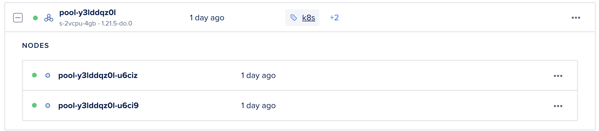
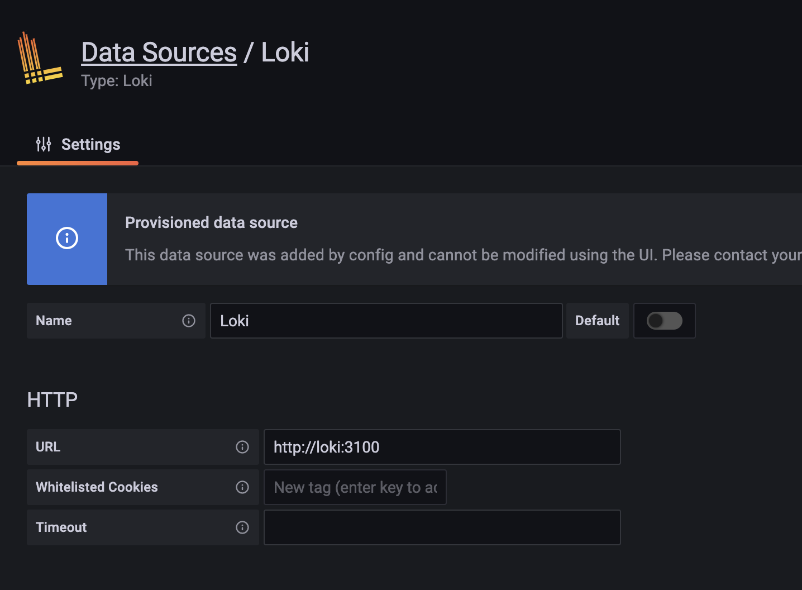
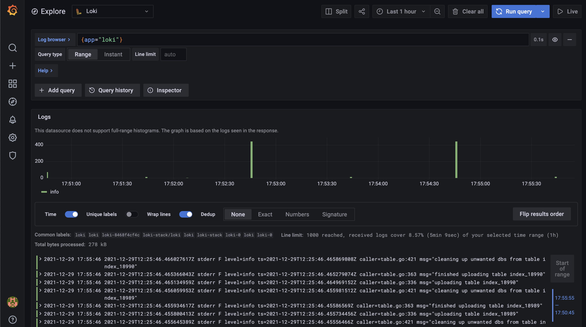
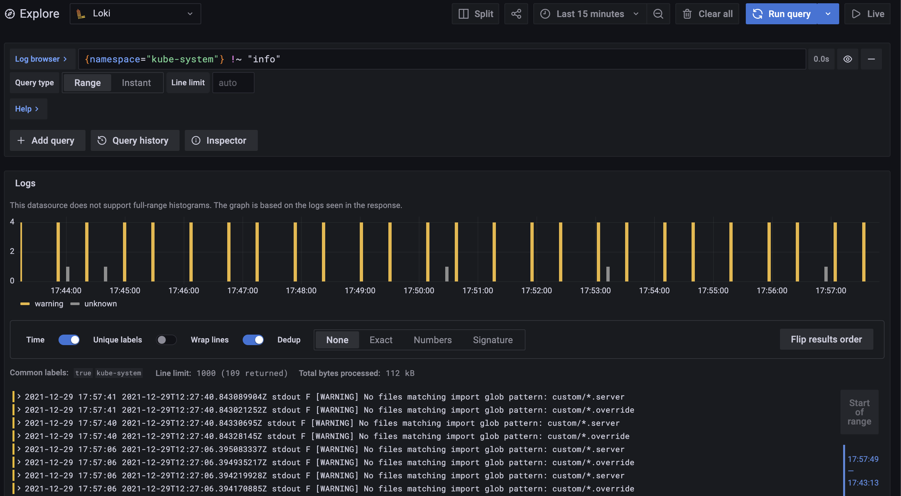

# Log monitoring Solution with Loki

This is my entry for [Deploy a log monitoring system
](https://www.digitalocean.com/community/pages/kubernetes-challenge)

We will use [Loki](https://grafana.com/oss/loki/) for the purpose of centralised log datastore and use [Grafana](https://grafana.com/) to view the logs & use fluentbit running as a [Daemonset](https://kubernetes.io/docs/concepts/workloads/controllers/daemonset/) to collect logs from our nodes `/var/lib/containers/*/logs` path
All these components can be installed by [loki-stack](https://github.com/grafana/helm-charts/tree/main/charts/loki-stack) helm chart easily

- [Install K8s Cluster](#install-k8s-cluster)
- [Install loki & grafana](#installing-loki-and-grafana)
- [View Loki](#view-logs-on-grafana)
- [Upgrade Loki](#upgrade-loki)
- [Cleaning loki](#cleaning-up)

## Install K8s cluster

Installing a DOKS Cluster is straight forward and just a few button of clicks away

- we used 1.21.5 version for our k8s deployment
- we used 2 vcpu & 4 Gb ram instance nodepool for this exercise
  

- Fetch the k8s config from UI Or using the DOCTL cli

```bash
doctl kubernetes cluster kubeconfig save <clusterid>
```

- some basic commands to make navigating with cli easy:

```bash
export KUBECONFIG=<downloaded file location>
echo 'source <(kubectl completion bash)' >>~/.bashrc
echo 'alias k=kubectl' >>~/.bashrc
echo 'complete -F __start_kubectl k' >>~/.bashrc
```

## Installing Loki and Grafana

- you can use 1-click Installs by Digital Ocean to get it up and running in minutes OR install it manually yourself with some custom values. Note: 1 click install will also install it via helm, but in automated fashion
  

### Install Loki & grafana manually by helm

Helm is a package manager which templates your k8s manifests and uses parameters from `values.yml` to reduce the redundancy.

- Install Helm on your local machine (it's a client side binary that calls your k8s-server api remotely) by following this [doc](https://helm.sh/docs/intro/install/)
- First we need to add helm repo and fetch charts from that repo

```
helm repo add grafana https://grafana.github.io/helm-charts
helm repo update
```

- To customize our loki deployment we will first fetch the default values and change it accordingly

```
 helm show values grafana/loki-stack > values.yml
```

Change the Values to your usecase for our example I have modified the [values.yml](./values.yml)

> Our usecase:
>
> - Use persistent volume (otherwise your logs will be lost on new deployment or if the container dies)
> - set a retention period, so logs don't fill up the Volume
> - use fluentbit instead of promtail (fluentbit is less resource intensive compared to fluentd & promtail)
> - include Grafana installation

```
loki:
    enabled: true
    persistence:
        enabled: true
        size: 50Gi
fluent-bit:
  enabled: true
```

Alternatively, You could use inline command to achieve the same

```
helm upgrade --install loki grafana/loki-stack \
  --set fluent-bit.enabled=true,promtail.enabled=false,grafana.enabled=true,prometheus.enabled=true,prometheus.alertmanager.persistentVolume.enabled=false,prometheus.server.persistentVolume.enabled=false
```

- Install the chart in our cluster

```
helm upgrade --install loki grafana/loki-stack -n loki-stack -f values.yml
```

- Verify the installation by checking

```
helm list -n loki-stack
k get po,svc,pv,pvc -n loki-stack
```

- you can see the Persistent volumes being provisioned and attach to your pods to avoid data loss

```

NAME                               READY   STATUS    RESTARTS   AGE
pod/loki-0                         1/1     Running   0          2d13h
pod/loki-grafana-89cfb5949-sp9bg   1/1     Running   0          2d13h
pod/loki-promtail-2d5dt            1/1     Running   0          2d13h
pod/loki-promtail-fknhm            1/1     Running   0          2d13h

NAME                    TYPE        CLUSTER-IP      EXTERNAL-IP   PORT(S)    AGE
service/loki            ClusterIP   10.245.0.112    <none>        3100/TCP   2d13h
service/loki-grafana    ClusterIP   10.245.89.168   <none>        80/TCP     2d13h
service/loki-headless   ClusterIP   None            <none>        3100/TCP   2d13h

NAME                                                        CAPACITY   ACCESS MODES   RECLAIM POLICY   STATUS   CLAIM                                                 STORAGECLASS       REASON   AGE
persistentvolume/pvc-304bc8d4-90f3-4027-bbd6-a9e83fc96099   10Gi       RWO            Delete           Bound    kube-prometheus-stack/kube-prometheus-stack-grafana   do-block-storage            2d13h
persistentvolume/pvc-c43e141f-3318-4484-8e6a-cfa938ced328   10Gi       RWO            Delete           Bound    loki-stack/loki-grafana                               do-block-storage            2d13h
persistentvolume/pvc-cec008c7-f9e5-444f-88ce-f36838c8f30a   50Gi       RWO            Delete           Bound    loki-stack/storage-loki-0                             do-block-storage            2d13h

NAME                                   STATUS   VOLUME                                     CAPACITY   ACCESS MODES   STORAGECLASS       AGE
persistentvolumeclaim/loki-grafana     Bound    pvc-c43e141f-3318-4484-8e6a-cfa938ced328   10Gi       RWO            do-block-storage   2d13h
persistentvolumeclaim/storage-loki-0   Bound    pvc-cec008c7-f9e5-444f-88ce-f36838c8f30a   50Gi       RWO            do-block-storage   2d13h
```

## View logs on Grafana

- Fetch the Grafana password from your loki-stack installation

```
kubectl get secret --namespace <YOUR-NAMESPACE> loki-grafana -o jsonpath="{.data.admin-password}" | base64 --decode ; echo
```

- We can use port-forward to expose grafana to view logs

```
kubectl port-forward --namespace <YOUR-NAMESPACE> service/loki-grafana 3000:80
```

- Upon logging into grafana, you will notice Loki is already configured as the Data source in Grafana



- fluentbit Takes your Pod/Container Labels and allows your to query loki for logs based on these labels
- Loki uses LogQL to query, Go to `localhost:3000/explore` and run a few queries to see logs
  - {app="loki"}
  - {namespace="kube-system"} !~ "info"

## 



The benefit of having your Monitoring & Logging stack share the same Frontend is you can club them together to detect issues in a single Panel, Eg: More number of 5xx may result in higher CPU usage, that may be caused by Connection errors depicted by logs.

## Upgrade loki

Upgrading loki installation is also easy with helm
use the same command with a different set of values

```
helm upgrade --install loki grafana/loki-stack -n loki-stack -f values.yml
```

## Cleaning up

`helm uninstall -n loki-stack loki`

check all pods/svc/pv's should be deleted now

`k get po,svc,pv,pvc -n loki-stack`
